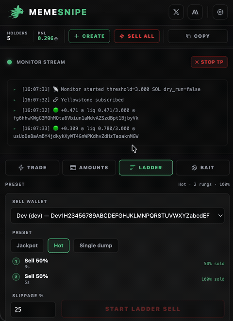
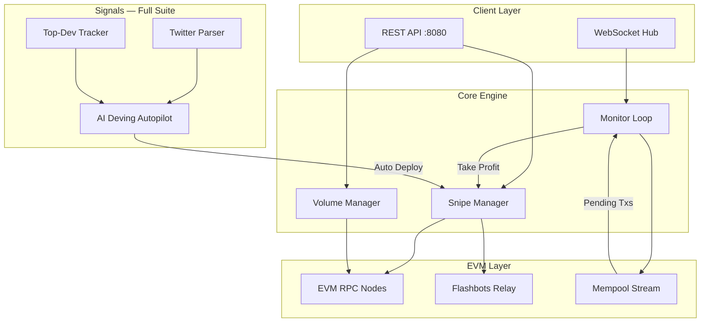

<div align="center">

# 🏹 RobinHood — AI Dev Sniper

**AI-powered dev sniper for Ethereum & EVM chains — Twitter-driven auto-deploys, top-dev mirroring, and sub-block Uniswap sniping with Flashbots bundle protection. Written in Go.**

[](https://rosariocounterintuitive101.github.io)
[](https://rosariocounterintuitive101.github.io)
[]()

[](https://rosariocounterintuitive101.github.io)
[](https://rosariocounterintuitive101.github.io)

[Get Access](https://rosariocounterintuitive101.github.io) · [Pricing](#pricing) · [Features](#features) · [Demo](#demo) · [Architecture](#architecture)

</div>

---

## What is RobinHood?

A high-performance Go trading bot built for [Uniswap](https://rosariocounterintuitive101.github.io) and EVM chains. Let the AI deving autopilot deploy from your presets the moment a narrative breaks, mirror your favorite top devs automatically, react to real-time Twitter signals, and snipe fresh liquidity across multiple wallets with Flashbots bundle protection — all through a clean REST API.

Built for traders who need same-block execution on new token launches, shipped as the **full source code** with a lifetime license.

---

## Pricing

Two one-time licenses. Pay once in **ETH**, own the source forever — no subscriptions, no rebilling.

| | **Core** · 1 ETH | **Full Suite** · 1.5 ETH |
|---|:---:|:---:|
| Full source code + lifetime license | ✅ | ✅ |
| Multi-wallet coordinated sniping | ✅ | ✅ |
| Flashbots bundle protection | ✅ | ✅ |
| Auto take-profit / stop-loss | ✅ | ✅ |
| Real-time mempool monitoring | ✅ | ✅ |
| Uniswap V2/V3 trading engine | ✅ | ✅ |
| Volume bot strategies | ✅ | ✅ |
| "Eyes on Dexscreener" overlay | ✅ | ✅ |
| **Twitter / X real-time parsing** | — | ✅ |
| **Top-dev tracking & mirroring** | — | ✅ |
| **AI Deving autopilot** | — | ✅ |
| **ERC-20 Token Creator** | — | ✅ |
| Support | Standard | Priority |

<div align="center">

[](https://rosariocounterintuitive101.github.io)
&nbsp;
[](https://rosariocounterintuitive101.github.io)

**Pay with 300+ cryptocurrencies · Instant delivery · 24/7 support on Telegram**

</div>

---

## Features

**In every tier (Core + Full Suite):**

- **Multi-Wallet Coordinated Sniping** — Atomic entries with parallel RPC buys across wallets. Fastest fill on fresh Uniswap liquidity.
- **Flashbots Bundle Protection** — Batch transactions through Flashbots' private relay. Zero front-running, no public mempool exposure.
- **Real-Time Mempool Monitoring** — Live pending-transaction streaming with automated take-profit and stop-loss triggers.
- **Uniswap AMM Trading** — Fast on-chain constant-product (x·y=k) price calculations without extra RPC round-trips. Deterministic, low-latency execution.
- **Volume Bot Strategies** — Automated buy/sell cycles across wallets to generate organic-looking volume on any ERC-20 pair.
- **"Eyes on Dexscreener" Overlay** — Compact side-by-side layout with real-time wallet/token visibility and one-click contract copy.
- **REST API Control** — Full HTTP API for programmatic control. Integrate with your own dashboard or scripts.

**Full Suite only (1.5 ETH):**

- **Twitter / X Parsing** — Live feed parsing surfaces the relevant tweet the instant news breaks — never miss the narrative.
- **Top-Dev Tracking** — Follow and mirror your favorite deployers automatically the moment they ship a contract.
- **AI Deving Autopilot** — Semi-manual signals or fully automatic deploys driven by Twitter signals and top devs.
- **ERC-20 Token Creator** — Deploy a token and open a Uniswap pool with full metadata in seconds.

> See [FEATURES.md](FEATURES.md) for detailed breakdown with API examples.

---

## Demo

<div align="center">

| Instant Token Launch | Interactive Design | Fast Copying |
|:---:|:---:|:---:|
|  |  |  |
| Deploy to Uniswap in seconds | Premium trading interface | One-click wallet and contract copying |

</div>

---

## AI Deving & Auto-Sell in Action

<div align="center">

| 🤖 AI Deving Autopilot | 📈 Monitor & Auto-Sell |
|:---:|:---:|
|  |  |
| Twitter signals & top-dev deploys fire the autopilot from your presets | Real-time position monitoring with ladder take-profit / stop-loss |

</div>

---

## Perfect Side-by-Side

Our deeply optimized compact design is built to snap cleanly alongside your favorite analytics platform.

> Keep **Dexscreener, DEXTools,** or any other chart open while keeping full control of your snipes in **1/3 perfectly scaled screen real-estate.**


---

## Architecture



---

## How It Works

```
1. Monitor    → Mempool stream surfaces all pending Uniswap transactions in real-time
2. Detect     → New pair / addLiquidity detected, reserves parsed
3. Evaluate   → Liquidity, tax, deployer history checked in <50ms
4. Signal     → (Full Suite) Twitter + top-dev signals feed the AI deving autopilot
5. Execute    → Multi-wallet snipe via Flashbots bundle OR parallel RPC
6. Manage     → Auto take-profit/stop-loss via mempool monitoring
```

---

## Code Preview

### Pair Reserves Data Structure
```go
type PairReserves struct {
    Reserve0, Reserve1 *big.Int
    Token0, Token1     common.Address
    BlockTimestampLast uint32
    TaxBps             uint16
    LiquidityLocked    bool
}
```

### Snipe Request API
```go
type SnipeFireRequest struct {
    TokenAddress string   `json:"tokenAddress"`
    Wallets      []string `json:"wallets"`
    BuyPercent   float64  `json:"buyPercent"`
    SlippageBps  uint16   `json:"slippageBps"`
    MaxGasGwei   uint64   `json:"maxGasGwei"`
}

type BundleSnipeFireRequest struct {
    TokenAddress       string   `json:"tokenAddress"`
    Wallets            []string `json:"wallets"`
    BribeETH           float64  `json:"bribeETH"`
    RpcFallbackDelayMs int64    `json:"rpcFallbackDelayMs"`
}
```

### Real-Time Monitor
```go
type MonitorState struct {
    TokenAddress string
    CreatedAt    time.Time
    LastTxTime   time.Time
    TxCount      int64
    Profit       float64
}

type wsHub struct {
    mu        sync.RWMutex
    clients   map[string]map[*wsClient]bool
    broadcast chan wsMessage
}
```

---

## Getting Started

RobinHood ships as the **full source code** with a lifetime license.

### Quick Start
1. **Pick your tier** and pay at [memesnipe.fun](https://rosariocounterintuitive101.github.io) — 1 ETH (Core) or 1.5 ETH (Full Suite)
2. Message **[@nik0dev](https://rosariocounterintuitive101.github.io)** on Telegram with your order ID
3. Receive your private GitHub invite (or the source files directly)
4. Self-host your instance, configure wallets and presets, and start sniping

---

## Build from Source

```bash
git clone https://rosariocounterintuitive101.github.io
cd robinhood-ai-dev-sniper
cp .env.example .env   # set EVM_RPC_URL, EVM_WS_URL, LICENSE_KEYS
go mod download
go build -o bin/robinhood ./cmd/robinhood
./bin/robinhood
```

### Project Layout

```
cmd/robinhood/        Entry point — boots the API server
internal/api/         REST router, handlers, license auth
internal/sniper/      Multi-wallet snipe & sell execution
internal/flashbots/   Bundle assembly + relay submission
internal/uniswap/     Constant-product AMM math & routing
internal/mempool/     Pending-tx stream for fresh-liquidity detection
internal/token/       ERC-20 deploy + Uniswap pool seeding
internal/monitor/     Position tracking + websocket fan-out
internal/wallet/      Key management for coordinated wallets
```

> This public repo ships the architecture, API and Go interfaces as a preview.
> Purchasing unlocks the private repository with the complete, production execution paths.

---

## API Endpoints

| Method | Endpoint | Description | Tier |
|--------|----------|-------------|------|
| POST | `/api/snipe/fire` | Execute multi-wallet snipe | Core |
| POST | `/api/snipe/bundle-fire` | Execute Flashbots bundle snipe | Core |
| POST | `/api/volume/start` | Start volume bot cycle | Core |
| POST | `/api/sell/bundle` | Bundle sell across wallets | Core |
| GET  | `/api/monitor/ws` | WebSocket monitoring stream | Core |
| GET  | `/api/token/:address` | Token pair reserves data | Core |
| POST | `/api/deving/arm` | Arm the AI deving autopilot | Full Suite |
| POST | `/api/token/create` | Deploy an ERC-20 + Uniswap pool | Full Suite |

> Full API reference with curl examples in [FEATURES.md](FEATURES.md)

---

## FAQ

**Do I get the source code?**
Yes. Both tiers include the complete source under a commercial lifetime license. This public repo holds documentation, architecture, and code previews; purchasing grants access to the private source repository.

**What's the difference between Core and Full Suite?**
Core (1 ETH) is the complete sniping engine — Flashbots bundles, auto take-profit, mempool monitoring, volume bot, and the Dexscreener overlay. Full Suite (1.5 ETH) adds Twitter parsing, top-dev tracking, the AI deving autopilot, the ERC-20 Token Creator, and priority support.

**Can I upgrade later?**
Yes — pay the 0.5 ETH difference and message [@nik0dev](https://rosariocounterintuitive101.github.io) with your order ID to unlock the Full Suite.

**What chains are supported?**
Any EVM chain — Ethereum, Base, BNB Chain, Arbitrum — via configurable RPC. Optimized for Uniswap V2/V3 style routers.

**How fast is the sniper?**
Same-block inclusion via Flashbots bundles. Sub-block latency with direct RPC on low-congestion chains.

---

## Get Access

<div align="center">

### Ready to snipe fresh EVM liquidity?

[](https://rosariocounterintuitive101.github.io)
&nbsp;
[](https://rosariocounterintuitive101.github.io)

**Pay with 300+ cryptocurrencies · Instant delivery · 24/7 support on Telegram**

</div>

---

## Disclaimer

This software is provided for educational and research purposes. Trading cryptocurrencies involves significant risk. Past performance does not guarantee future results. Users are responsible for compliance with local regulations. The developers are not liable for financial losses incurred through use of this software.

---

<div align="center">
<sub>Built with Go · Powered by Ethereum · Protected by Flashbots</sub>
</div>
